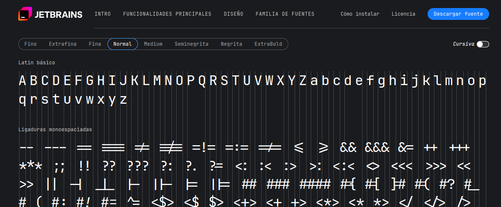

# Procedimiento de configuracion de huayra linux

## veificar entorno de ventanas

```bash
echo $XDG_CURRENT_DESKTOP
```

## instalar fuentes

1. Donde se guardan las fuentes en linux

2. Algunas Fuentes:

<div style="display: flex; justify-content: center; align-items: center; align-content: center; gap: 10px; padding: 10px; flex-wrap: wrap;">
  <div
      style="width: 400px; height: 250px; border-radius: 4px; border:1px solid; display: flex; flex-direction: column; justify-content: center; align-items: center; padding: 5px; gap: 5px;">
      <h2>JetBrain</h2>
      
      <a href="https://www.nerdfonts.com/">jetBrains fuente</a>
  </div>
  <div
      style="width: 400px;  height: 250px; border-radius: 4px; border:1px solid; display: flex; flex-direction: column; justify-content: center; align-items: center; padding: 5px; gap: 5px;">
      <h2>NerdFont</h2>
      
      <a href="https://www.nerdfonts.com/">nerdFonts fuente</a>
  </div>
  <div
      style="width: 400px;  height: 250px; border-radius: 4px; border:1px solid; display: flex; flex-direction: column; justify-content: center; align-items: center; padding: 5px; gap: 5px;">
      <h2>Google Fonts</h2>
      
      <a href="https://www.nerdfonts.com/">Google Fonts</a>
  </div>
</div>

* copiamos la fuente al directorio de fuentes del sistema

 ```bash
 sudo cp /ruta/a/tus/fuentes/*.ttf /usr/share/fonts/
 ```

* Actualizamos la cache de fuentes:

 ```bash
 sudo fc-cache -fv
 ```

## Instalar y Aplicar Temas de Color

* Instalar herramientas necesarias:
 Asegúrate de tener instaladas las herramientas necesarias para administrar temas

 ```bash
 sudo apt-get install mate-themes mate-tweak
 ```

* Descargar y Copiar Temas compatibles (gtk3):
 Descarga temas compatibles con MATE desde sitios como Gnome-look.org.
 Copia el tema descargado al directorio de temas:

 ```bash
 sudo cp -r /ruta/a/tu/tema /usr/share/themes/
 ```

* Aplicar el Tema:
 Abre MATE Tweak desde el menú de aplicaciones o ejecuta:

 ```bash
 mate-tweak
 ```

 Nota: Ve a la sección Apariencia.
 Selecciona el tema que acabas de instalar en la sección de Tema.
 Cambiar el Tema de la Terminal
 Cambiar el tema de la terminal:
 Abre mate-terminal.
 Ve a Editar > Preferencias del perfil.
 Selecciona el perfil que estás usando (por defecto es Sin nombre).
 Ve a la pestaña Colores.
 Aquí puedes personalizar los colores de fondo, texto y otros elementos de la terminal.

## Resumen de Comandos

```bash
# Copiar fuentes al directorio de fuentes del sistema
sudo cp /ruta/a/tus/fuentes/*.ttf /usr/share/fonts/
sudo fc-cache -fv

# Instalar herramientas de administración de temas
sudo apt-get install mate-themes mate-tweak

# Copiar temas al directorio de temas del sistema
sudo cp -r /ruta/a/tu/tema /usr/share/themes/

# Abrir MATE Tweak para cambiar el tema
mate-tweak
```

## Links importantes

NOTA: [personaliza huayra linux](https://huayra.educar.gob.ar/primeros-pasos/)

## persoalizacion de escritorio

[gome looks](https://www.gnome-look.org/browse/)

## Vamos a configurar temas

* Descargamos compatible gtk3 desde gnome looks.

 ```bash
  administrador@conectarigualdad  ~/Descargas/temas/temas  ls
 Andromeda                             Nordic-darker-v40
 Dracula                               Nordic-Polar
 Dracula-pink-accent                   Nordic-Polar-standard-buttons
 Dracula-pink-accent-standard-buttons  Nordic-Polar-standard-buttons-v40
 Mojave-Dark                           Nordic-Polar-v40
 Nordic-darker

 administrador@conectarigualdad  ~/Descargas/temas/temas  sudo cp -r ./* ~/.themes 
 [sudo] password for administrador: 
 
  administrador@conectarigualdad  ~/Descargas/temas/temas  ls ~/.themes 
 Andromeda                             Nordic-darker-v40
 Dracula                               Nordic-Polar
 Dracula-pink-accent                   Nordic-Polar-standard-buttons
 Dracula-pink-accent-standard-buttons  Nordic-Polar-standard-buttons-v40
 Mojave-Dark                           Nordic-Polar-v40
 Nordic-darker
 
 ```

 **NOTA** en teoria esta carpeta es un link simbolico hacia /usr/share/hemes, tambien puedo copiarlos directamente aca .

  1. luego solo deberiamos abrir el menu de configuraciones:
  2. En huayra hacemos clic derecho sobre el escritorio seleccionamos cambiar fondo d eecritorio.
  3. vamos donde dice temas y ya comenzamos a modificar, cambiar el tema manualmente.. si hacemos clic en personalizar podremos cambiar el paquete de icono.

## cambiamos el entorno de ventanas

Esta guía te mostrará cómo instalar un nuevo entorno de escritorio en Huayra Linux utilizando `tasksel`, sin eliminar el entorno actual que estás utilizando. Además, mantendremos `lightdm` como el gestor de sesiones predeterminado para garantizar una experiencia consistente.

para ello usaremos usaremos **tasksel**

### 1. Instalar `tasksel`

`tasksel` es una herramienta que facilita la instalación de grupos completos de paquetes. Si no lo tienes instalado, sigue estos pasos:

1. Abre una terminal.
2. Ejecuta el siguiente comando para instalar `tasksel`:

   ```bash
   sudo apt-get install tasksel
   ```

   

### Ejecutar tasksel

Una vez que tasksel esté instalado, puedes usarlo para instalar un nuevo entorno de escritorio.

```bash
sudo tasksel
```

Se abrirá una interfaz en modo texto que te permitirá seleccionar diferentes tareas para instalar.


**Seleccionar un Nuevo Entorno de Escritorio En la interfaz de tasksel, sigue estos pasos:**

1. Desplázate por la lista de tareas usando las teclas de flecha hasta encontrar el entorno de escritorio que deseas instalar, como **GNOME, KDE, XFCE**, u otro.
Usa la tecla Espacio para seleccionar el entorno de escritorio que quieres instalar.
Una vez seleccionado, presiona Enter para comenzar la instalación.
tasksel se encargará de instalar todos los paquetes necesarios para el nuevo entorno de escritorio.  


2. Configuración del Gestor de Sesiones
Durante la instalación, se te pedirá que elijas un gestor de sesiones predeterminado. Se te dará la opción entre **gdm3 y lightdm**.


Selecciona **lightdm** como el gestor de sesiones predeterminado. Esto asegurará que mantengas una experiencia consistente y ligera con tu entorno de escritorio actual (MATE).

Si en algún momento decides cambiar el gestor de sesiones, puedes hacerlo más adelante utilizando:

```bash
sudo dpkg-reconfigure lightdm
```

### Reiniciar el Sistema

Una vez que la instalación haya terminado, es necesario reiniciar el sistema para aplicar los cambios:

```bash
sudo reboot
```

1. Seleccionar el Entorno de Escritorio
Después de reiniciar tu computadora:

En la pantalla de inicio de sesión, antes de ingresar tu contraseña, busca una opción que te permita **elegir el entorno de escritorio**.
Selecciona el entorno de escritorio que acabas de instalar.
Si prefieres seguir utilizando tu entorno anterior (MATE), selecciónalo en la misma pantalla.

Ahora podrás elegir entre tu entorno de escritorio actual y el nuevo cada vez que inicies sesión en tu sistema.

## estaremos en gnome, pero esta en blanco, deemos modificarlo

1. abrimos retoques
  este nos permite aplicar los temas que ya tenemos instalados, los iconos, y demas.
2. caso no este inastalado , proedemos a instalarlo:

    ```bash
     administrador@conectarigualdad  ~  sudo apt install retoques
    ```

    o vamos a inicio, ecribimos software y buscamos retoques

3. instalamos extenciones necesarias:

    ```bash
    sudo apt install gnome-shell-extensions chrome-gnome-shell
    ```

4. Luego vamos a gnome extencion:

    [gnome extencion](https://extensions.gnome.org/)

* aca podemos instalar extenciones y utilidades, como es el caso de dash-to-dock, que nos permitira instalar un panel inferior.


* luego desde retoques --> extenciones: podemos configurar las extenciones acorde a nuestro gusto.

## descargamos walppapers

[alphacoders](https://wall.alphacoders.com/big.php?i=996764)

## que es linux

[que es linux](https://ed.team/blog/que-es-linux-495b9964-a661-46a4-9e80-e3267e932f0b)

## distros linux

* [distros linux](https://es.wikipedia.org/wiki/Anexo:Distribuciones_Linux)
* [distros hacking](https://blog.elhacker.net/2021/11/mejores-distribuciones-de-linux-para-hacking-etico-pentest.html)
  * [parrot os](https://parrotsec.org/)
  * [kali Linux](https://www.kali.org/)
  * [black arch](https://blackarch.org/)

## entornos de ventana linux

### mas comunes

* [entornos de ventana comunes](https://www.arsys.es/blog/entornos-escritorio-linux)
* [mas entornos](https://victorhckinthefreeworld.com/2020/02/28/38-gestores-de-ventanas-o-entornos-de-escritorio-para-linux/)

NOTA: las siguientes son paginas donde ver entornos:

* [unixporn](https://www.reddit.com/r/unixporn/)

*

## distros llamativas y comunes

* [debian](https://www.debian.org/index.es.html)
* [mint](https://linuxmint.com/)
* [steam](https://store.steampowered.com/steamos)
* [arch](https://archlinux.org/)
* [archcraft](https://archcraft.io/)

## Etornos personalizados por la comunidad

* [Zlcube kali bspwn](https://github.com/ZLCube/KaliBspwm)
* [dotfile](https://github.com/gh0stzk/dotfiles)
* [zprogrer bspwn](https://github.com/Zproger/bspwm-dotfiles)

## estructura de directorios

* [estructura de directorios](https://itsfoss.com/es/estructura-directorios-linux/)
