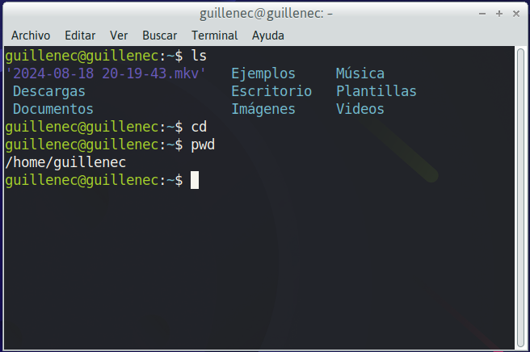
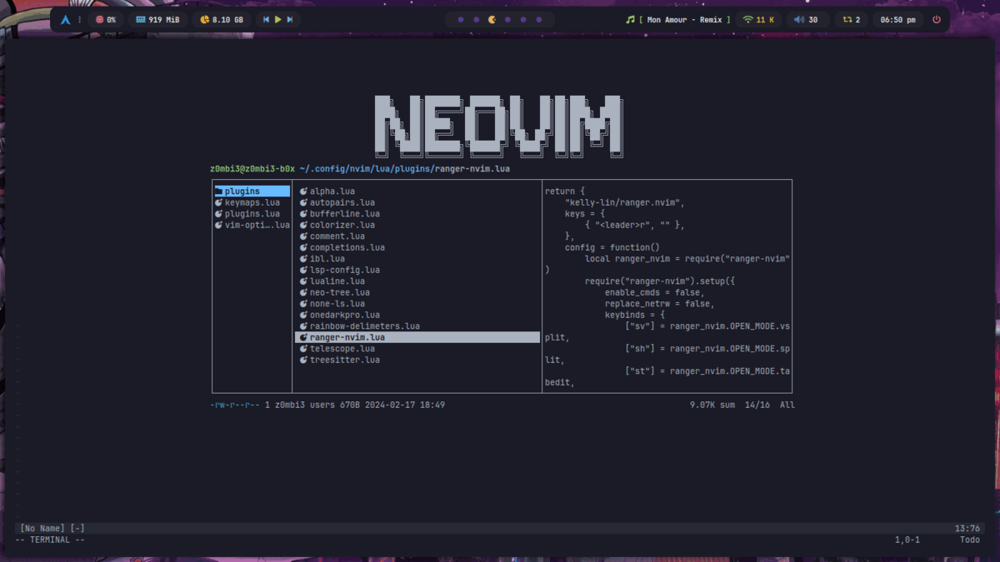
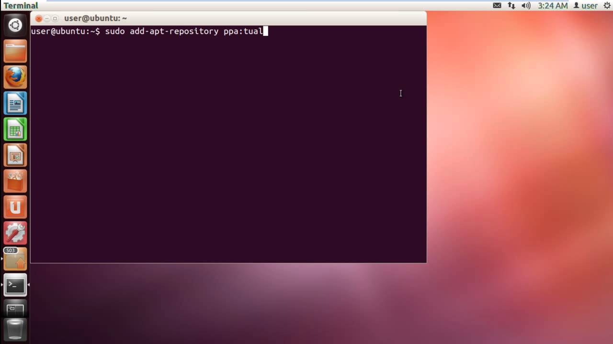
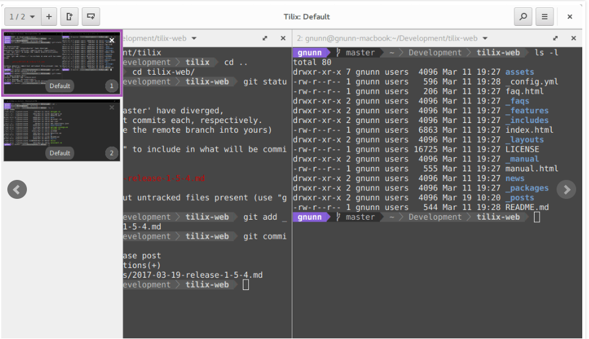
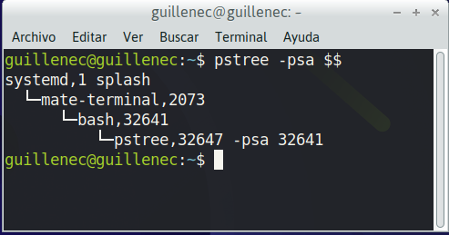

# Terminal linux





Una terminal es un punto de entrada de texto en un equipo, también llamado interfaz de línea de comandos (CLI).

 La terminal permitirá a los usuarios interactuar con los ordenadores; mientras que la consola se conectará al terminal para la comunicación de bajo nivel con el S.O (sistema operativo)

## diferencia shell terminal

[diferencia shell y terminal](https://keepcoding.io/blog/diferencia-entre-consola-terminal-shell/#:~:text=As%C3%AD%20pues%2C%20el%20terminal%20permitir%C3%A1,los%20servicios%20de%20un%20S.O.)

## Introducción a la Terminal de Linux

    * Concepto Básico: Explicar brevemente qué es una terminal y su importancia en Linux.
    * Diferencia entre Terminal y Shell: Aclarar que la terminal es la interfaz y el shell es el intérprete de comandos (por ejemplo, Bash o Zsh).

## Tipos de Terminales

### GNOME Terminal (Ubuntu)

Terminal por defecto en GNOME, simple y funcional.  
[documentacion gnomeTerminal](https://help.gnome.org/users/gnome-terminal/stable/overview.html.es)  
GNOME terminal, también llamado gnome-terminal, es un emulador de terminal escrito por Havoc Pennington y otros. Es parte del proyecto de escritorio libre GNOME. GNOME terminal permite a los usuarios ejecutar comandos usando una interfaz dentro de un entorno de ventanas.



### Tilix

[tilix-web](https://gnunn1.github.io/tilix-web/)
Descripción: Terminal tiling que permite dividir la pantalla en múltiples terminales.



* **Comando de Instalación**

```bash
    sudo apt install tilix
```

### Terminator


erminator es un emulador de terminal de código abierto programado en Java. Está disponible en Microsoft Windows, macOS, Linux y otros sistemas Unix que utilizan el sistema X Window. Terminator se ejecutará en cualquier sistema POSIX moderno que ejecute Java 6 o posterior.

Permite organizar terminales en una cuadrícula.
[terminator](https://gnome-terminator.org/)

Comando de Instalacion:

```bash
sudo apt install terminator
```

### Alacritty


Alacritty es un emulador de terminal acelerado por GPU gratuito y de código abierto centrado en el rendimiento y la simplicidad. En consecuencia, no admite tabulaciones ni divisiones y se configura editando un archivo de texto. Está escrito en Rust y usa OpenGL. Un emulador de terminal similar que usa OpenGL es kitty.

Descripción: Terminal rápido y ligero, basado en OpenGL.
[link alacrity](https://alacritty.org/)

Comando de Instalación:

```bash
sudo apt install alacritty
```

### Terminal de Huayra

presentar

## Introducción a Shells



Una shell de Unix es el término usado en informática para referirse al intérprete de comandos de los sistemas operativos basados en Unix y similares, como GNU/Linux, y que es su interfaz de usuario tradicional. Mediante las instrucciones que aporta el intérprete, el usuario puede comunicarse con el núcleo y por extensión, ejecutar dichas órdenes, así como herramientas que le permiten controlar el funcionamiento de la computadora. Por ello, en inglés se le denominó así, shell, que puede ser traducido como «cáscara», porque es la envoltura visible del sistema informático.
[shells wikipedia](https://es.wikipedia.org/wiki/Shell_de_Unix)

### bash

Bash: Shell por defecto en muchas distribuciones.
es una interfaz de usuario de línea de comandos popular, específicamente un shell de Unix; así como un lenguaje de scripting.
Bash es un intérprete de órdenes que generalmente se ejecuta en una ventana de texto donde el usuario escribe órdenes en modo texto. Bash también puede leer y ejecutar órdenes desde un archivo, llamado guion o 'script', que son secuencias de comandos escritas en el lenguaje de scripting de Bash. Estos scripts permiten automatizar tareas y combinar comandos y estructuras de control en un solo archivo.
[link wikipedia](https://es.wikipedia.org/wiki/Bash)

### zsh

Zsh: Shell avanzado con más opciones de personalización.
Z shell (o simplemente zsh) es un potente intérprete de comandos para sistemas operativos de tipo Unix, como por ejemplo los BSD o GNU/Linux.
[link wikipedia](https://es.wikipedia.org/wiki/Zsh)

## Oh my zsh

El Oh My ZSH es un framework para gestionar la configuraciones de ZSH. Permite el uso de temas diversos compartidos por la comunidad.
[oh my zsh github](https://github.com/ohmyzsh/ohmyzsh)

## guia configuracon oh my zsh

### Verificamos si esta instalado

    ```bash
    # verificamos si esta instalado
    zsh --version
    # listamos las shells
    echo $SHELL
    ```

### Instalamos zsh

    ```bash
    # instalamos:
    sudo apt install zsh

    # vovemos a verificar:
    zsh --version

    echo $SHELL

    # Configuramos como shell predeterminado
    chsh -s $(which zsh)

    # Tenga en cuenta que esto no funcionará si Zsh no está en su lista de shells autorizados ( /etc/shells) o si no tiene permiso para usar chsh

    ```

### Instalación Oh My Zsh

    ```bash
    sh -c "$(curl -fsSL https://raw.githubusercontent.com/ohmyzsh/ohmyzsh/master/tools/install.sh)"
    ```

    luego abrimos el archivo de configuracion ~/.zshrc

    ```bash
    sudo vim ~/.zshrc
    # la sig linea contiene el tema, usamos uno de los que queramos.
    ZSH_THEME="robbyrussell"

    # luego hacemos
    source ~/.zshrc
    ```

### Fuentes

Al instalar un tema de terminal, puede que se vea mal.. esto se debe a que necesitamos que las fuentes que usemos tengan ligaduras y demas, para esto hay que empezar a instalar fuentes:

* para agnoster es necesario powerline

    ```bash
    sudo apt install fonts-powerline
    ```

* Instalación de NerdFonts (por ejemplo, Hack):

    ```bash
    sudo apt install fonts-hack-ttf
    ```

### Esquemas de color para la terminal

#### Instalaremos los esquemas de color de Gogh


    Gooh es una coleccion de colores para varios emuladores de terminal.

#### Pre Install

    ```bash
    sudo apt-get install dconf-cli uuid-runtime
    ```

#### instalacion Modo interactivo

* Solo copie y pegue :

```bash
bash -c "$(wget -qO- https://git.io/vQgMr)"
```

* seleccione el tema de color o all para todos


* [Gogh-Co/Gogh github](https://github.com/Gogh-Co/Gogh)
* [pywal github](https://github.com/dylanaraps/pywal)
* [Dracula theme page](https://draculatheme.com/)

### Otras terminales

* [warp](https://www.warp.dev/)
