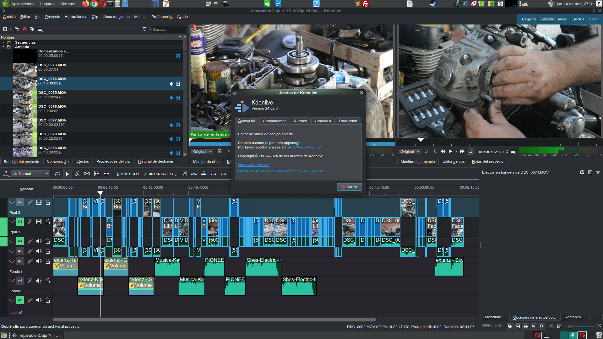

# **kdenlive** Notas - instalacion



## Que es Kdenlive??

Kdenlive es un editor de videos, uno de los mas potente y mas faciles de usar en linux.. en este caso nos centraremos en huayra linux, ya que esta destinado al uso en instiituciones educativas.. esto debido a que es un [software libre](https://www.gnu.org/philosophy/free-sw.es.html).
Kdenlive es un acrónimo de KDE Non-Linear Video Editor. Es un software que fue concebido principalmente para la plataforma GNU/Linux pero funciona incluso en BSD, MacOS y está siendo exitosamente implementado en la plataforma Windows como proyecto GSOC.

Los sistemas de edición y montaje no lineares (Non-linear video editing) son mucho más eficaces y poderosos que los predecesores sistemas tradicionales, ya que ofrecen un mayor control y precisión a la hora de elaborar proyectos de nivel profesional. Éste programa también es ideal para ser usado por principiantes y pequeños proyectos personales.

## Licencia

Este programa es un Free Software (software gratuito) tal y como lo describe la Free Software Foundation y cumpliendo con las condiciones de la [GNU General Public License](https://en.wikipedia.org/wiki/GNU_General_Public_License)

## Instalacion

Se deja link a la pagina oficial, donde se detalla las diferentes formas y para los diferentes OS, ya sea Mac, Windows, Ubuntu o x version de Linux [Link pagina kdenlive](https://kdenlive.org/en/download/) .

### **En este caso Veremos la forma de instalarlo en HUaira**  

* Actualizamos las dependencias de nuestro sstema:

  ```bash
   administrador@conectarigualdad  ~  sudo apt update
  ```

* Procedemos a instalar el paquete kdenlioe:

  ```bash
   administrador@conectarigualdad  ~  sudo apt install kdenlive
  ```

  📓Nota: en el proceso de istalacion nos puede recomendar instalar algunos paquete , por ejemplo (estos no se instalaran solos, por lo que a posteriori deberemos instalarlos de manera manual, para ello copiaremos y pegaremos)

  ¨¨¨bass
  Paquetes sugeridos:
    khelpcenter
  Paquetes recomendados:
    swh-plugins breeze-icon-theme oxygen-icon-theme dvgrab frei0r-plugins
    recordmydesktop dvdauthor genisoimage libkf5filemetadata-bin
  Se instalarán los siguientes paquetes NUEVOS:
    kded5 kdenlive kdenlive-data libkf5filemetadata-data libkf5filemetadata3
    libkf5notifyconfig-data libkf5notifyconfig5 libmlt-data melt
  0 actualizados, 9 nuevos se instalarán, 0 para eliminar y 17 no actualizados.
  Se necesita descargar 12,8 MB de archivos.
  Se utilizarán 98,5 MB de espacio de disco adicional después de esta operación.
  ¿Desea continuar? [S/n]
  ¨¨¨
  
  📓Nota: procedemos a instalarlos:

  ```bash
  sudo apt install khelpcenter swh-plugins breeze-icon-theme oxygen-icon-theme dvgrab frei0r-plugins recordmydesktop dvdauthor genisoimage libkf5filemetadata-bin
  ```

  * Ejecutamos kdenlive desde la terminal o desde la barra de probramas.
  
  ```bash
  kdenlive

  ```

### Video Instal Uso Basico

[](https://www.youtube.com/watch?v=mYJ-QH_aXCU)
