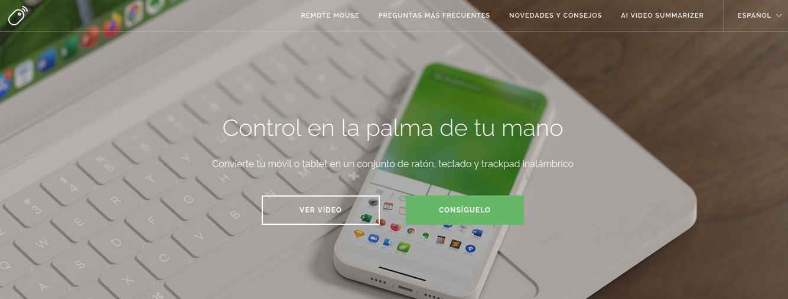
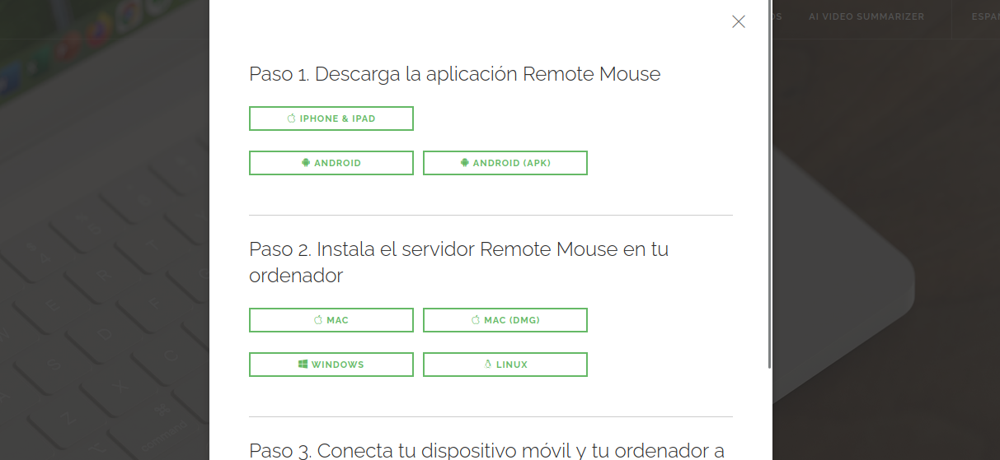

# Procedimiento de Instalación de RemoteMouse



## 1. **Descargar RemoteMouse**

- Ve al sitio web oficial de RemoteMouse o a la fuente de descarga proporcionada para Linux.
- Descarga el archivo correspondiente, que generalmente estará en formato `.zip`.

   ```bash
   wget [URL_DEL_ARCHIVO_REMOTE_MOUSE_ZIP]
   ```



## 2. **Extraer el Archivo Descargado**

- Una vez descargado el archivo `.zip`, extráelo en un directorio de tu elección:

   ```bash
   unzip RemoteMouse_x86_64.zip -d ~/Descargas/remoteMouse
   cd ~/Descargas/remoteMouse/RemoteMouse_x86_64
   ```

## 3. **Instalar Dependencias Necesarias**

- Asegúrate de que todas las dependencias necesarias estén instaladas en tu sistema. Ejecuta el siguiente comando para instalar las bibliotecas requeridas:

   ```bash
   sudo apt-get update
   sudo apt-get install libxcb-xinerama0 libxcb-icccm4 libxcb-image0 libxcb-keysyms1 libxcb-render-util0 libxcb-randr0 libxcb-shm0 libxcb-sync1 libxcb-xfixes0 libxcb-xkb1 libgl1-mesa-glx libxkbcommon-x11-0 libxkbcommon0
   ```

   **Nota**: Si al ejecutar RemoteMouse obtienes un error relacionado con `libxcb-util1`, sigue los pasos a continuación para descargar e instalar ese paquete desde Debian 12 (Bookworm).

## 4. **Instalar `libxcb-util1` desde Debian 12 (Bookworm)**

- Si la biblioteca `libxcb-util1` no está disponible en tu repositorio, puedes proceder a descargarla manualmente e instalarla.

- **Descargar el paquete `.deb`**:
     Puedes descargar el archivo desde el siguiente enlace:

     ```bash
     wget http://ftp.de.debian.org/debian/pool/main/x/xcb-util/libxcb-util1_0.4.0-1+b1_amd64.deb
     ```

- **Instalar el paquete**:
     Una vez descargado, puedes instalar el paquete con `dpkg`:

     ```bash
     sudo dpkg -i libxcb-util1_0.4.0-1+b1_amd64.deb
     ```

     Si durante la instalación `dpkg` indica dependencias faltantes, puedes resolverlas con:

     ```bash
     sudo apt-get install -f
     ```

## 5. **Configurar el Firewall para RemoteMouse**

- Si tienes un firewall activo (por ejemplo, `ufw`), debes permitir el tráfico en los puertos que RemoteMouse utiliza (puerto 1978 tanto TCP como UDP):

   ```bash
   sudo ufw allow 1978/tcp
   sudo ufw allow 1978/udp
   sudo ufw enable
   ```

## 6. **Ejecutar RemoteMouse**

- Dirígete al directorio donde se extrajo RemoteMouse y ejecuta el programa:

   ```bash
   cd ~/Descargas/remoteMouse/RemoteMouse_x86_64
   ./RemoteMouse
   ```

- Verifica que los servidores TCP y UDP están activos y escuchando:

   ```bash
   UDP server up and listening
   Tcp server thread started...
   Dock server up and listening
   ```

## 7. **Conectar desde tu Dispositivo Móvil**

- Asegúrate de que tanto tu computadora como tu dispositivo móvil estén conectados a la misma red Wi-Fi.
- Abre la aplicación RemoteMouse en tu teléfono.
- Si la computadora no aparece automáticamente, selecciona la opción "Conectar con IP" e ingresa la dirección IP de tu computadora (puedes obtenerla con `ip a` en la terminal).

   **Ejemplo de IP**: `10.0.60.32`

## 8. **Comprobación Final**

- Verifica que puedes controlar tu computadora desde tu teléfono usando RemoteMouse.
- Si tienes problemas de conexión, asegúrate de que el firewall no esté bloqueando el tráfico y que ambos dispositivos estén en la misma red.

## 9. **Opcional: Crear un Atajo para Iniciar RemoteMouse**

- Descargamos y mobemos el icono a usar a la carpeta icons

```bash
cp icono.png /usr/share//remotemouse.png
```

- creamos el archivo lanzador

```bash
nano ~/.local/share/applications/remotemouse.desktop

```

- Contenido del archivo:

```bash
[Desktop Entry]
Version=1.0
Name=RemoteMouse
Version=1.0
Name=RemoteMouse
Comment=Start RemoteMouse
Exec=nohup /home/administrador/Descargas/remoteMouse/RemoteMouse_x86_64/RemoteMouse > /dev/null 2>&1 &
Icon=/usr/share/iconse/remotemouse.png
Terminal=false
Type=Application
Categories=Utility;Application;
```

- Puedes crear un script de inicio rápido para ejecutar RemoteMouse automáticamente:

   ```bash
   echo -e '#!/bin/bash\ncd ~/Descargas/remoteMouse/RemoteMouse_x86_64 && ./RemoteMouse &' > ~/remote_mouse_start.sh
   chmod +x ~/remote_mouse_start.sh
   ```

   Ahora puedes ejecutar RemoteMouse fácilmente con:

   ```bash
   ~/remote_mouse_start.sh
   ```

### **Notas Finales**

- **Actualización del Sistema**: Mantén tu sistema y dependencias actualizadas para evitar problemas de compatibilidad.
- **Seguridad**: Si usas `ufw` u otro firewall, asegúrate de mantener las reglas de seguridad adecuadas.
