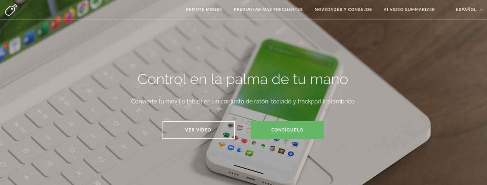
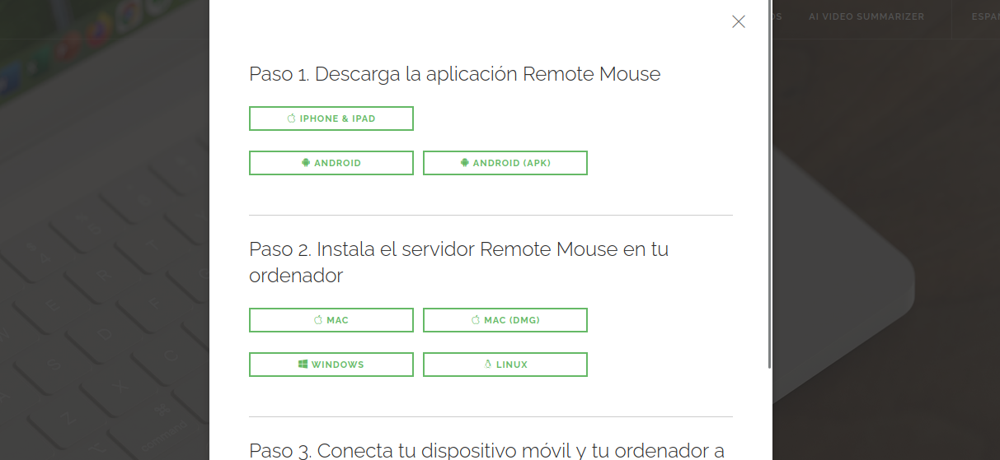

# guia instalacion REMOTE MOUSE

[guia remote mouse](https://www.remotemouse.net/)



Convierte tu móvil o tablet en un conjunto de ratón, teclado y trackpad inalámbrico

## vamos a la pagina y descargamos el ejecutable

seleccionamos obtener o descargar , noa aparecera lo sig :



Para instalar y utilizar Remote Mouse en tu sistema Linux, puedes seguir estos pasos:

## nos movemos al directorio donde lo descargamos

```bash
cd Descargas
```

### 1. Ver el contenido del archivo `README.md`

Este archivo ya lo has revisado, y contiene información importante sobre la instalación y el uso del software.

### 2. Ejecutar el archivo `install.sh`

Este script es el encargado de realizar la instalación de Remote Mouse. Debes ejecutarlo como usuario root. Aquí te muestro cómo hacerlo:

1. **Abre la terminal** en la ubicación donde tienes el archivo `install.sh` (en tu caso, ya estás en la carpeta correcta: `~/Descargas/remoteMouse/RemoteMouse_x86_64`).

2. **Ejecuta el script de instalación** con el siguiente comando:

   ```bash
   sudo ./install.sh
   ```

   - **sudo** se usa para ejecutar comandos con privilegios de superusuario.
   - **./install.sh** es el comando que ejecuta el script de instalación.

3. **Sigue las instrucciones en pantalla**: Si el script requiere algún tipo de confirmación o configuración adicional, sigue las indicaciones.

### 3. Ejecutar Remote Mouse

Una vez completada la instalación, puedes ejecutar Remote Mouse con el siguiente comando:

```bash
./RemoteMouse
```

### 4. Solución de problemas (Opcional)

Si estás utilizando Ubuntu 22 y encuentras un error GLib-GIO al iniciar el software:

1. **Cierra la sesión actual**.
2. **En la pantalla de inicio de sesión**, busca la configuración en la esquina inferior derecha.
3. **Cambia la sesión a "Ubuntu on XOrg"** y luego inicia sesión nuevamente.

### 5. Limitaciones

- **No soporta lanzador de aplicaciones** en la versión para Linux.
- **El soporte de portapapeles está limitado** solo a texto.

### Resumen Rápido de Comandos

1. Navegar a la carpeta de instalación:

   ```bash
   cd ~/Descargas/remoteMouse/RemoteMouse_x86_64
   ```

2. Ejecutar el script de instalación:

   ```bash
   sudo ./install.sh
   ```

3. Ejecutar la aplicación:

   ```bash
   ./RemoteMouse
   ```
